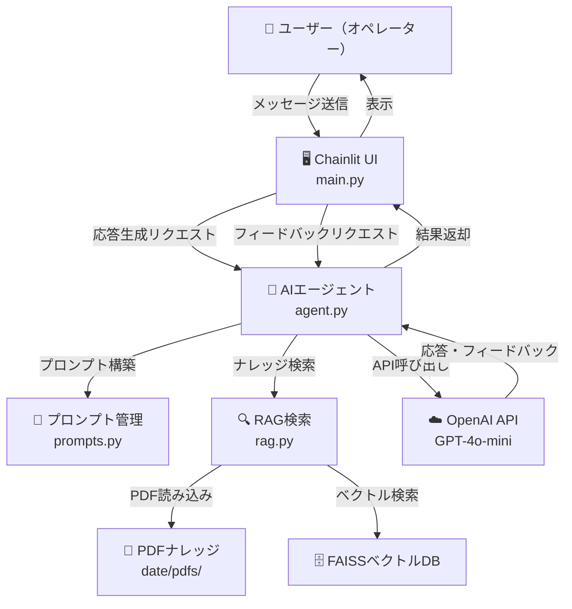

# RoleUp

> 🚧 現在開発中です（2026年4月〜）

## 🎯 概要

新人オペレーターから経験者まで、幅広く使えるAIロールプレイトレーニングツールです。
チャット形式で顧客役AIと模擬対応を行い、終了後にAIが対応内容をフィードバックします。

## 🚀 使い方

1. 🎚️ 難易度を選択する（初級・中級・上級）
2. 📋 シナリオを選択する（解約引き止め・請求トラブルなど）
3. 💬 顧客役AIとチャットで模擬対応を行う
4. ✅ 「対応終了」と入力するとフィードバックが表示される

## 💡 設計背景

前職でチャット・コールオペレーターの新人育成を担当していた経験から、
ロールプレイ練習の機会が少ないという課題を感じていました。
また、経験者であっても成績が伸び悩む場面では、
客観的なフィードバックを得る手段が限られていました。
そこで、新人から経験者まで幅広く活用できるトレーニングツールを開発しました。

## 🖥 使用環境

| 項目 | 内容 |
|---|---|
| OS | Windows 11（Windows環境で開発・動作確認） |
| Python | 3.11 |
| フレームワーク | Chainlit |
| LLM | OpenAI API（LangChain経由） |
| ベクトルDB | FAISS |
| 主なライブラリ | LangChain, langchain-openai, langchain-community, PyMuPDF, FAISS |
| デプロイ | 未定 |

## 🛠️ 技術スタック

| 技術 | 用途 |
|---|---|
| Python | バックエンド全体 |
| Chainlit | チャットUI・会話フロー制御 |
| LangChain | 会話管理・フィードバック生成 |
| langchain-openai | OpenAI APIとの連携 |
| langchain-community | FAISSベクトルストア連携 |
| OpenAI GPT-4o-mini | 顧客役AI・フィードバック生成 |
| FAISS | ベクトル検索（RAG） |
| PyMuPDF | PDFナレッジの読み込み |

## 🏗️ アーキテクチャ図



## 📁 ディレクトリ構成

```
roleup/
├── app/
│   ├── main.py        # Chainlitエントリーポイント・UI制御
│   ├── agent.py       # AI応答・フィードバック生成ロジック
│   ├── prompts.py     # プロンプト管理（ロールプレイ・フィードバック）
│   └── rag.py         # PDFナレッジ読み込み・ベクトル検索
├── date/
│   └── pdfs/          # RAG用PDFナレッジ格納フォルダ
├── .chainlit/         # Chainlit設定ファイル
├── chainlit.md        # Chainlitウェルカムメッセージ
├── requirements.txt   # 依存パッケージ一覧
└── README.md
```

## ⚙️ セットアップ手順

### 1. リポジトリをクローン

```bash
git clone https://github.com/biguver-cloud/roleup.git
cd roleup
```

### 2. 仮想環境を作成・有効化

```bash
python -m venv venv

# Windows
venv\Scripts\activate
```

### 3. 依存パッケージをインストール

```bash
pip install -r requirements.txt
```

### 4. 環境変数を設定

プロジェクトルートに `.env` ファイルを作成し、OpenAI APIキーを設定してください。

```
OPENAI_API_KEY=your_api_key_here
```

### 5. PDFナレッジを配置

`date/pdfs/` フォルダにRAG用のPDFファイルを配置してください。

### 6. アプリを起動

```bash
chainlit run app/main.py
```

ブラウザで `http://localhost:8000` が開きます。

## ✨ 工夫した点

- 💼 難易度ごとの顧客の態度設計に現場経験を活かした
- 📈 初級から上級まで段階的な難易度を設けることで新人から経験者まで幅広く対応できる設計にした
- 🎭 シナリオは実務で頻出の場面（解約・請求・クレーム・新規契約）を厳選した

## 🔮 今後の拡張予定

- 🏥 業種別シナリオの追加（医療・金融・ECなど）
- 📊 セッションごとのスコア履歴表示
- 👥 育成担当者向けの受講者管理画面