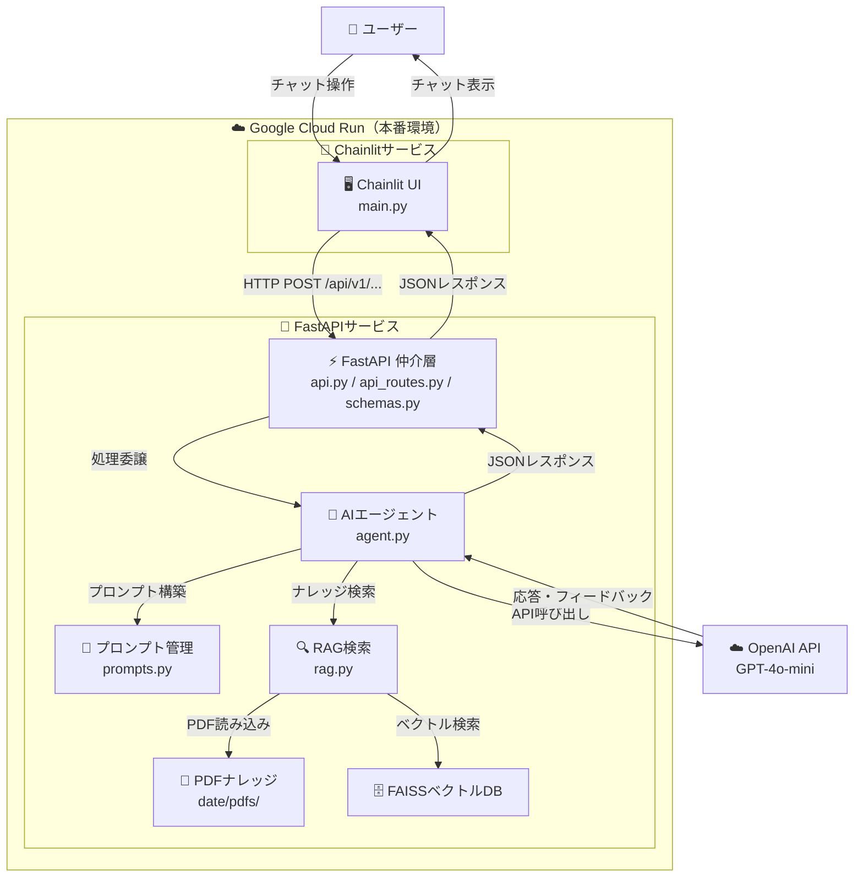

# RoleUp

## 🎯 概要

**RoleUp** は、新人オペレーターから経験者まで幅広く活用できる、AIを活用したロールプレイ型トレーニングツールです。

チャット・コールセンター業務において、ロールプレイ練習の機会が不足しがちという現場課題に着目して開発しました。
チャット形式で顧客役AIと模擬対応を行い、対応終了後にAIが会話内容を分析して具体的なフィードバックを返します。

- **難易度を3段階**（初級・中級・上級）から選択でき、新人研修にも、経験者のスキルアップにも対応
- **実務頻出シナリオ**（解約引き止め・請求トラブル・クレーム対応など）を厳選して収録
- **RAG（検索拡張生成）** を採用し、社内マニュアルなどのPDFナレッジを参照しながら応答を生成
- トレーナー不在でも、いつでも・何度でも練習できる **自己学習型**の設計

## 🚀 デプロイ済みURL

**本番環境（Google Cloud Run）:**
https://roleup-498951365205.asia-northeast1.run.app

## 🎓 目的

- **新人オペレーターの研修** — 実際の顧客対応を想定したロールプレイを通じて、現場に出る前にスキルを身につけられる
- **練習機会不足の解消** — トレーナーや相手役がいなくても、いつでも・何度でも反復練習できる環境を提供する
- **経験者の応対品質向上** — 上級難易度のシナリオで難易度の高い対応を繰り返し練習し、さらなるスキルアップを図れる

## ✨ 工夫した点

- 💼 難易度ごとの顧客の態度設計に現場経験を活かした
- 📈 初級から上級まで段階的な難易度を設けることで新人から経験者まで幅広く対応できる設計にした
- 🎭 シナリオは実務で頻出の場面（解約・請求・クレーム・新規契約）を厳選した

## 📁 ディレクトリ構成

```
roleup/
├── app/
│   ├── main.py        # Chainlit UI（フロントエンド）
│   ├── api.py         # FastAPIエントリーポイント・CORS設定
│   ├── api_routes.py  # FastAPI REST APIエンドポイント定義
│   ├── schemas.py     # APIリクエスト・レスポンスのPydantic型定義
│   ├── agent.py       # AI応答・フィードバック生成ロジック
│   ├── prompts.py     # プロンプト管理（ロールプレイ・フィードバック）
│   └── rag.py         # PDFナレッジ読み込み・ベクトル検索
├── date/
│   └── pdfs/          # RAG用PDFナレッジ格納フォルダ
├── .chainlit/         # Chainlit設定ファイル
├── chainlit.md        # Chainlitウェルカムメッセージ
├── tests/
│   ├── conftest.py        # テスト設定・フィクスチャ
│   └── test_api_routes.py # APIエンドポイントのテスト
├── cloudbuild.yaml        # Cloud Build設定（Chainlit：ビルド→デプロイ）
├── cloudbuild.api.yaml    # Cloud Build設定（FastAPI：テスト→ビルド→デプロイ）
├── Dockerfile             # ChainlitコンテナのDockerイメージ
├── Dockerfile.api         # FastAPIコンテナのDockerイメージ
├── docker-compose.yml     # 2コンテナ構成の起動定義
├── GITHUB_RULES.md        # GitHub運用ルール
├── requirements.txt       # 依存パッケージ一覧
├── requirements-dev.txt   # 開発・テスト用パッケージ一覧
└── README.md
```

## 🛠️ 技術スタック

| 技術 | 用途 |
|---|---|
| Python | バックエンド全体 |
| FastAPI | REST API仲介層（Chainlitとバックエンドをつなぐ） |
| Chainlit | チャットUI（フロントエンド） |
| httpx | ChainlitからFastAPIへの非同期HTTPリクエスト |
| Docker Compose | 2コンテナ構成のローカル起動 |
| LangChain | 会話管理・フィードバック生成 |
| langchain-openai | OpenAI APIとの連携 |
| langchain-community | FAISSベクトルストア連携 |
| OpenAI GPT-4o-mini | 顧客役AI・フィードバック生成 |
| FAISS | ベクトル検索（RAG） |
| PyMuPDF | PDFナレッジの読み込み |
| Docker | アプリケーションのコンテナ化・環境統一 |
| Google Cloud Run | サーバーレスコンテナデプロイ |

## 🏗️ アーキテクチャ図


```mermaid
flowchart TD
    User["👤 ユーザー"]
    OpenAI["☁️ OpenAI API\nGPT-4o-mini"]

    subgraph CloudRun["☁️ Google Cloud Run（本番環境）"]
        subgraph ChainlitSvc["🐳 Chainlitサービス\n（Dockerfile）"]
            Chainlit["🖥️ Chainlit UI\nmain.py"]
        end
        subgraph FastAPISvc["🐳 FastAPIサービス\n（Dockerfile.api）"]
            API["⚡ FastAPI 仲介層\napi.py / api_routes.py / schemas.py"]
            Agent["🤖 AIエージェント\nagent.py"]
            Prompts["📝 プロンプト管理\nprompts.py"]
            RAG["🔍 RAG検索\nrag.py"]
            PDF["📄 PDFナレッジ\ndate/pdfs/"]
            FAISS["🗄️ FAISSベクトルDB"]
        end
    end

    User -->|チャット操作| Chainlit
    Chainlit -->|"HTTP POST /api/v1/..."| API
    API -->|処理委譲| Agent
    Agent -->|プロンプト構築| Prompts
    Agent -->|ナレッジ検索| RAG
    RAG -->|PDF読み込み| PDF
    RAG -->|ベクトル検索| FAISS
    Agent -->|API呼び出し| OpenAI
    OpenAI -->|応答・フィードバック| Agent
    Agent -->|JSONレスポンス| API
    API -->|JSONレスポンス| Chainlit
    Chainlit -->|チャット表示| User
```

## ⚙️ セットアップ手順

```bash
git clone https://github.com/biguver-cloud/roleup.git
cd roleup
python -m venv venv
venv\Scripts\activate        # Windows
pip install -r requirements.txt
cp .env.example .env         # .env を開いて OPENAI_API_KEY を入力
```

> `date/pdfs/` にRAG用のPDFを配置してから起動してください。

**Docker Compose で起動する場合（推奨・本番と同じ2コンテナ構成）**

```bash
docker compose up --build
```

| サービス | URL | 説明 |
|---|---|---|
| Chainlit UI | `http://localhost:8080` | ロールプレイのチャット画面 |
| FastAPI Swagger | `http://localhost:8000/docs` | REST APIの動作確認画面 |

**個別に起動する場合**

```bash
# FastAPIを起動（先に起動する）
cd app
uvicorn api:app --reload     # http://localhost:8000

# Chainlitを起動（別ターミナルで）
chainlit run app/main.py     # http://localhost:8080
```

**Google Cloud Run へのデプロイ（CI/CD自動化済み）**

`main` ブランチへの push で以下が自動実行されます。

| トリガー | 自動実行内容 | 設定ファイル |
|---|---|---|
| `roleup-api-deploy` | pytest → ビルド → Cloud Runデプロイ（FastAPI） | `cloudbuild.api.yaml` |
| `roleup-deploy` | ビルド → Cloud Runデプロイ（Chainlit） | `cloudbuild.yaml` |

> テストが失敗した場合はビルド・デプロイがキャンセルされます。

> Secret Manager に `OPENAI_API_KEY` を事前に登録してください。

## 🚀 使い方

### Chainlit UI で使う場合（本番・推奨）

1. 🎚️ 難易度を選択する（初級・中級・上級）
2. 📋 シナリオを選択する（解約引き止め・請求トラブルなど）
3. 💬 顧客役AIとチャットで模擬対応を行う
4. ✅ 「対応終了」と入力するとフィードバックが表示される

### REST API で使う場合（APIテスト・動作確認用）

`http://localhost:8000/docs` をブラウザで開くとSwagger UIが表示され、画面上でAPIを試せます。

**APIエンドポイント一覧**

| メソッド | パス | 説明 |
|---|---|---|
| GET | `/api/v1/health` | サーバーの死活確認 |
| GET | `/api/v1/options` | 難易度・シナリオの選択肢を取得 |
| POST | `/api/v1/sessions` | セッション作成（会話の開始準備） |
| POST | `/api/v1/sessions/{id}/start` | 難易度・シナリオを選択して顧客役AIの第一声を取得 |
| POST | `/api/v1/sessions/{id}/messages` | メッセージを送信して顧客役AIの返答を取得 |
| POST | `/api/v1/sessions/{id}/feedback` | 会話全体のフィードバックを取得 |


▼ 起動時の画面


▼ シミュレーション実行中の画面


▼ フィードバック表示画面


## 🖥️ 使用環境

| 項目 | 内容 |
|---|---|
| OS | Windows 11（Windows環境で開発・動作確認） |
| Python | 3.11 |
| フレームワーク | Chainlit / FastAPI |
| LLM | OpenAI API（LangChain経由） |
| ベクトルDB | FAISS |
| コンテナ | Docker |
| 主なライブラリ | LangChain, langchain-openai, langchain-community, PyMuPDF, FAISS |
| デプロイ | Google Cloud Run（asia-northeast1） |

## 🔮 今後の拡張予定

- 🏥 業種別シナリオの追加（医療・金融・ECなど）
- 📊 セッションごとのスコア履歴表示
- 👥 育成担当者向けの受講者管理画面

## 👤 Author

[biguver-cloud](https://github.com/biguver-cloud)

## 📄 License

This project is for educational and demonstration purposes only.

本プロジェクトは **学習・ポートフォリオ目的** です。
実在の企業・サービスは含まれていません。

実運用時に追加で必要な対応：

- 🔐 認証・認可
- 📋 ログ管理
- 🙈 個人情報マスキング
- 🛡️ プロンプト・回答制御の強化
